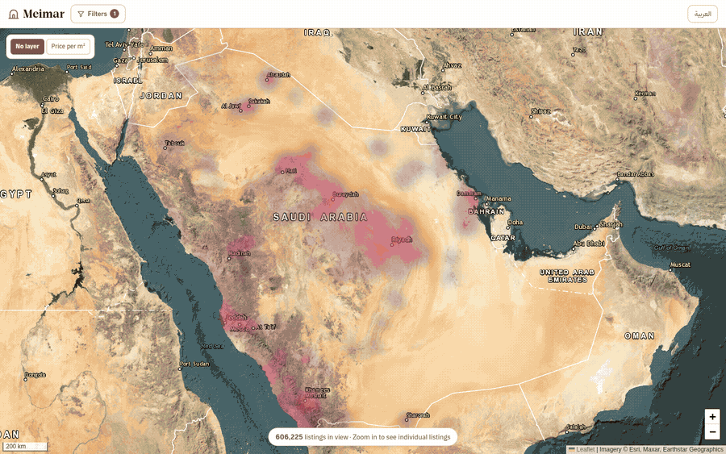
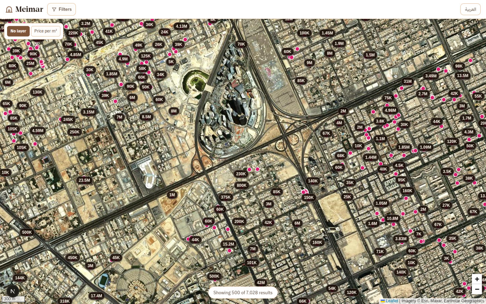
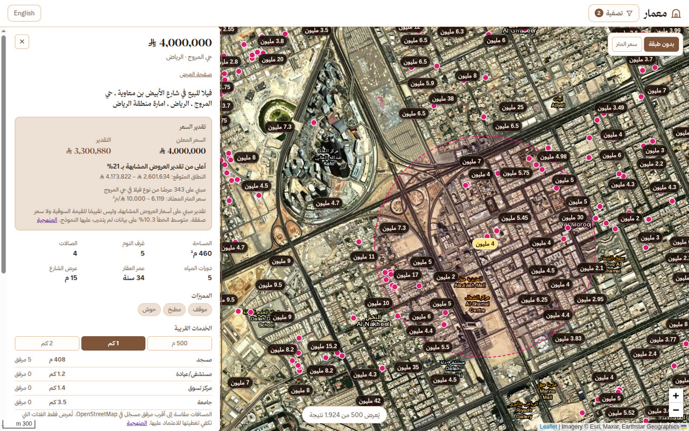
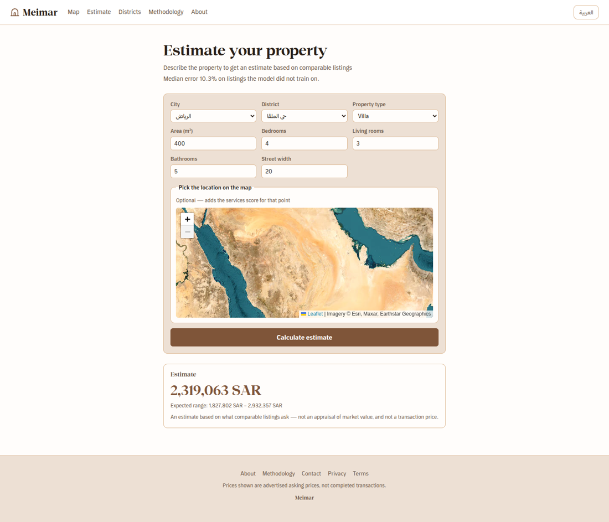
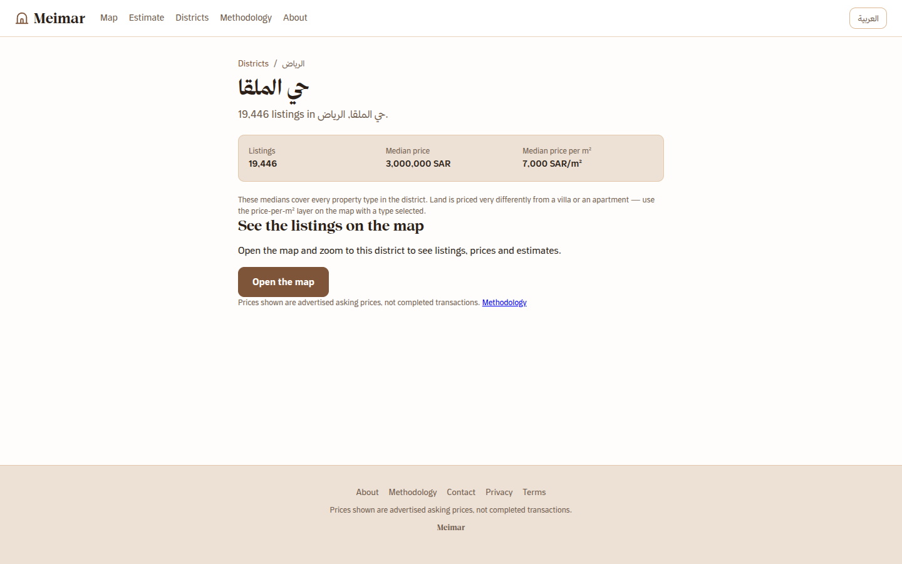
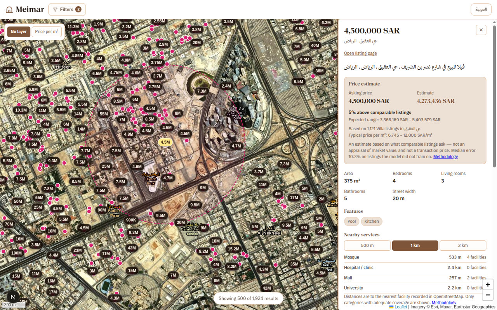
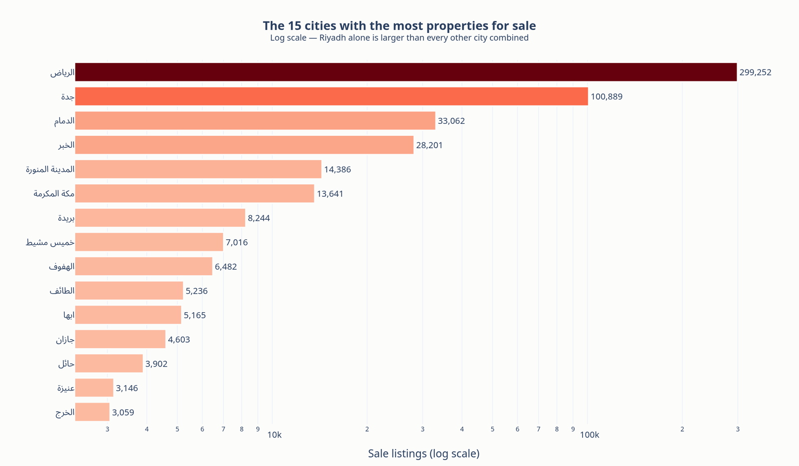
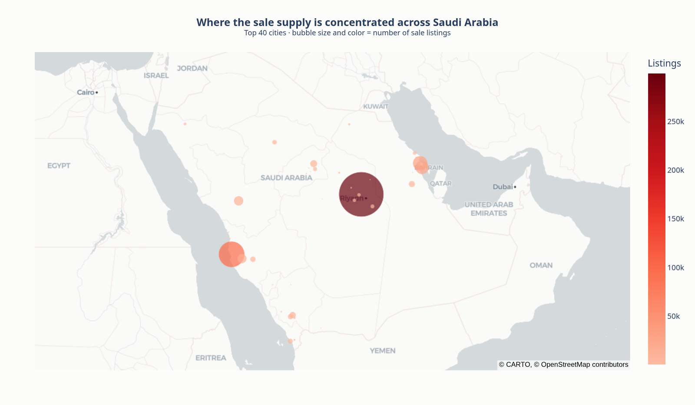
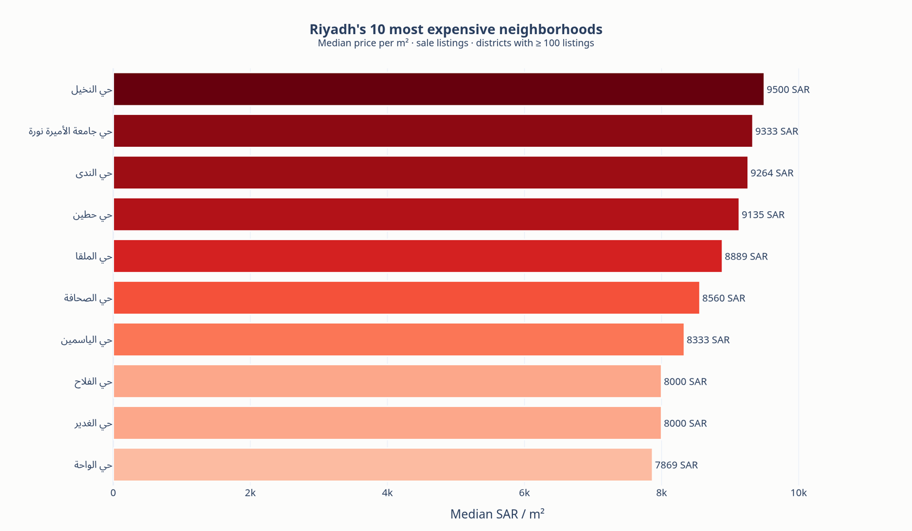
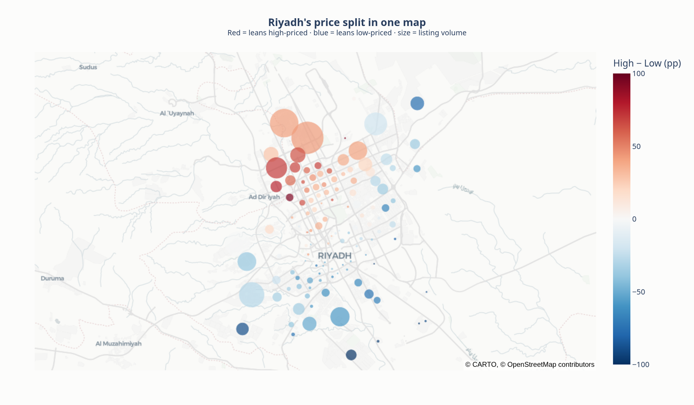

<h1>معمار · Meimar</h1>

**محرك أسعار وذكاء موقعي للعقار السعودي.**

[English](README.md) · **العربية**

---

أغلب مواقع العقار تخبرك بسعر العقار. معمار يخبرك إن كان هذا السعر منطقيًا —
وكيف ستكون الحياة في ذلك الموقع فعلًا.

يضع **781,382 عرضًا عقاريًا** في **97 مدينة سعودية** على خريطة واحدة، ويعرض
لـ **600,941** منها تقديرًا لما تطلبه العقارات المشابهة. وعند فتح أي عرض ترى
كم يبعد عن أقرب مسجد ومستشفى ومركز تسوق وجامعة.

**[▶ شاهد العرض التعريفي (36 ثانية)](docs/meimar-demo.mp4)** — كل صفحات المنصة، بالعربية

---

## نظرة سريعة

عند التصغير تتحول المملكة كلها إلى خريطة حرارية تُظهر أين يتحرك السوق. وعند
التكبير يصبح كل عقار دبوسًا يحمل سعره.

اضغط على أي دبوس لتقرأ قصة العقار: السعر المعلن، والتقدير بجانبه، وكم يرتفع أو
ينخفض عن العروض المشابهة. والدائرة المنقّطة على الخريطة هي نطاق المسافة الذي
اخترته.

تملك عقارًا أو تفكر في شراء واحد؟ صِف العقار واحصل على تقدير دون الحاجة إلى
إعلان أصلًا.

ولكل حي صفحته الخاصة: كم عقارًا معروضًا فيه، وكيف يبدو السعر المعتاد هناك.

الموقع كامل بالعربية والإنجليزية، بما في ذلك اتجاه الكتابة من اليمين إلى اليسار.

---

## ماذا تقول البيانات

قبل بناء أي شيء، جرى استكشاف العروض لمعرفة الشكل الحقيقي للسوق السعودي. بعض ما
ظهر:

**الرياض هي السوق.** فيها عروض بيع أكثر من بقية مدن المملكة مجتمعة.

**وفيها يتركّز المعروض.** كل دائرة مدينة، وحجمها يعكس عدد العقارات المعروضة
للبيع فيها.

**السعر مسألة عنوان.** أغلى أحياء الرياض تطلب نحو ثلاثة أضعاف ما تطلبه أرخصها،
لكل متر مربع.

**والانقسام جغرافي.** شمال المدينة وغربها يميلان إلى الارتفاع، وجنوبها وشرقها
إلى الأسعار الأقل — نمط تراه في صورة واحدة.

---

## كيف تستخدمه

1. **افتح الخريطة.** اختر ما تبحث عنه — للبيع أو للإيجار، فيلا أو شقة أو أرض — وحدّد نطاق السعر والمساحة.
2. **كبّر على الحي.** تظهر الأسعار مباشرة على الخريطة، فتقارن بين الشوارع بنظرة واحدة.
3. **اضغط على أي عقار.** تحصل على تفاصيله وتقدير سعره والخدمات القريبة ضمن 500 م أو 1 كم أو 2 كم.
4. **أو قدّر عقارك أنت.** صِف العقار في صفحة التقدير لتحصل على رقم، ومعه النطاق الذي يُرجّح أن يقع فيه.

---

## كيف بُني

الجزء غير المعتاد: **كل شيء تقريبًا يعمل داخل متصفحك.** لا يوجد خادم يستعلم من
قاعدة بيانات في الخلفية. تصل العروض إليك كملفات مضغوطة، ثم تجري التصفية والخرائط
والإحصاءات كلها على جهازك أنت. وهذا سبب سرعته رغم هذا الحجم.

| المكوّن | وظيفته |
|---|---|
| **Next.js + React** | الموقع نفسه، بالعربية والإنجليزية |
| **Leaflet + OpenStreetMap** | الخريطة، من مستوى الدولة حتى الشوارع |
| **DuckDB-WASM + Parquet** | البحث في 781,382 عرضًا داخل المتصفح |
| **XGBoost** | نماذج تقدير الأسعار |
| **FastAPI** | الخدمة الصغيرة خلف التقديرات الحرة |
| **Gemma (عبر Ollama)** | قراءة نص الإعلان العربي لاستخراج التفاصيل الناقصة |

### النماذج

نموذجان، لأن الأراضي والمباني تتصرف بشكل مختلف، ونموذج واحد سيكون أضعف في
كليهما:

| النموذج | يغطي | الخطأ المعتاد |
|---|---|---|
| **العقارات المبنية** | فلل، شقق، عمائر، أدوار | 10.3% |
| **الأراضي** | القطع، مسعّرة بالمتر المربع | 13.4% |

كل نموذج يُقاس على عروض لم يرها أثناء التدريب، فالدقة أعلاه هي ما ستحصل عليه مع
عقار جديد، لا رقمًا مجمّلًا.

والموقع مهم لهذه النماذج، لذلك قوبل كل عرض بخرائط OpenStreetMap لحساب بُعده عن
المرافق الحقيقية القريبة منه.

### ملاحظة صادقة

**هذه أسعار معلنة، وليست أسعار بيع.** المملكة لا تنشر ما بِيعت به العقارات
فعليًا، لذلك يجيب التقدير هنا عن سؤال *«كم تطلب العقارات المشابهة؟»* — لا عن
*«كم يساوي هذا العقار؟»*. الموقع يذكر ذلك عند كل رقم، ونحن نذكره هنا.

---

## محتويات المستودع

| المجلد | المحتوى |
|---|---|
| [`meimar/`](meimar) | تطبيق الويب وخدمة التقدير والنماذج المدرَّبة |
| [`Saudi_REAL_ESTATE_PROJECT/`](Saudi_REAL_ESTATE_PROJECT) | تجهيز البيانات ودفاتر الاستكشاف ومسار استخراج النصوص |

تعليمات التشغيل موجودة في [`meimar/README.md`](meimar/README.md). ويحتاج التطبيق
إلى توليد ملفات بياناته أولًا، فهي أكبر من أن تُحفظ داخل المستودع.

---

بُني بلوحة من خمسة ألوان، وخط ثمانية، وعدد كبير من العروض العقارية.

